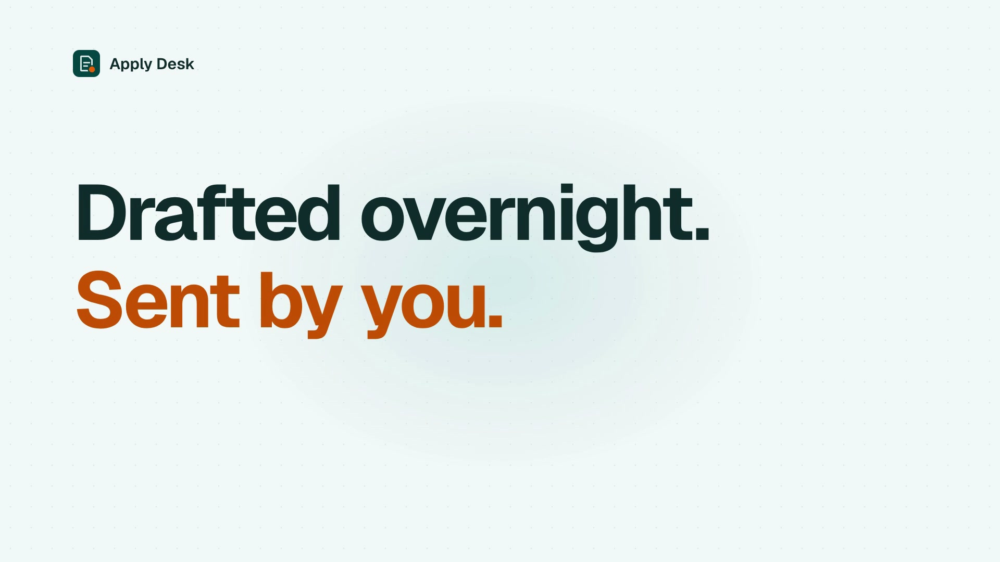
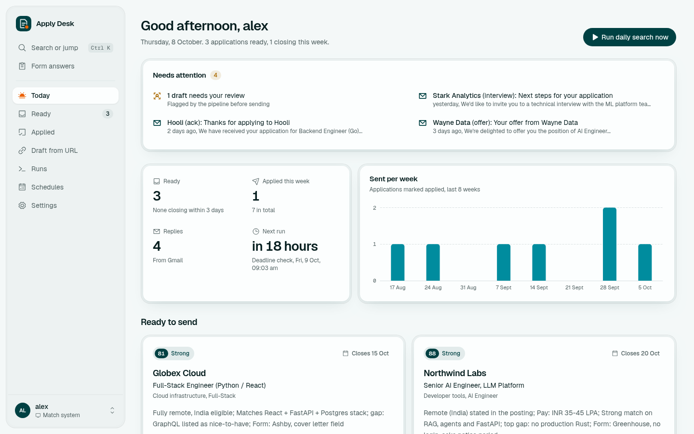
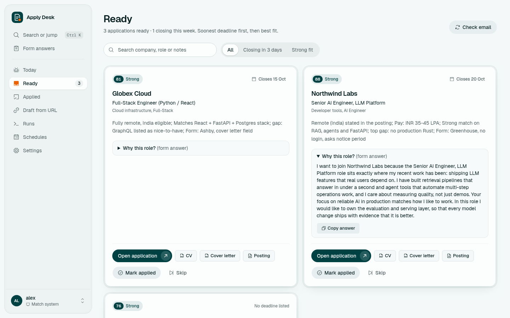
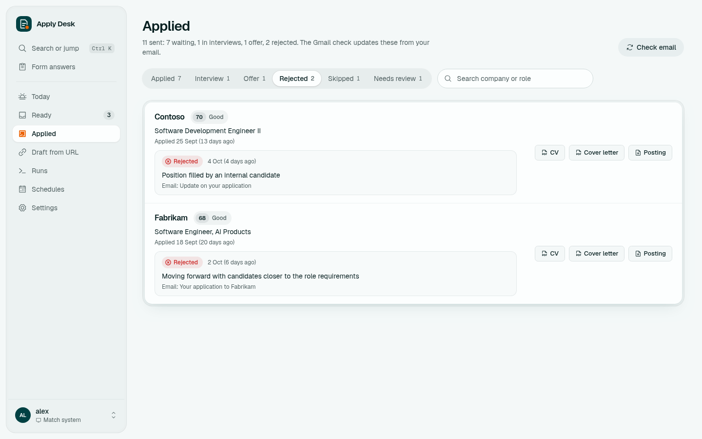
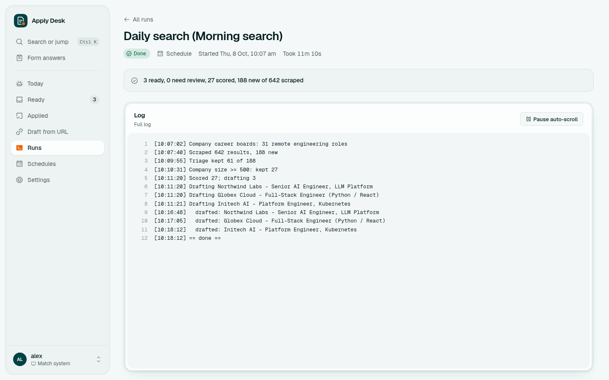
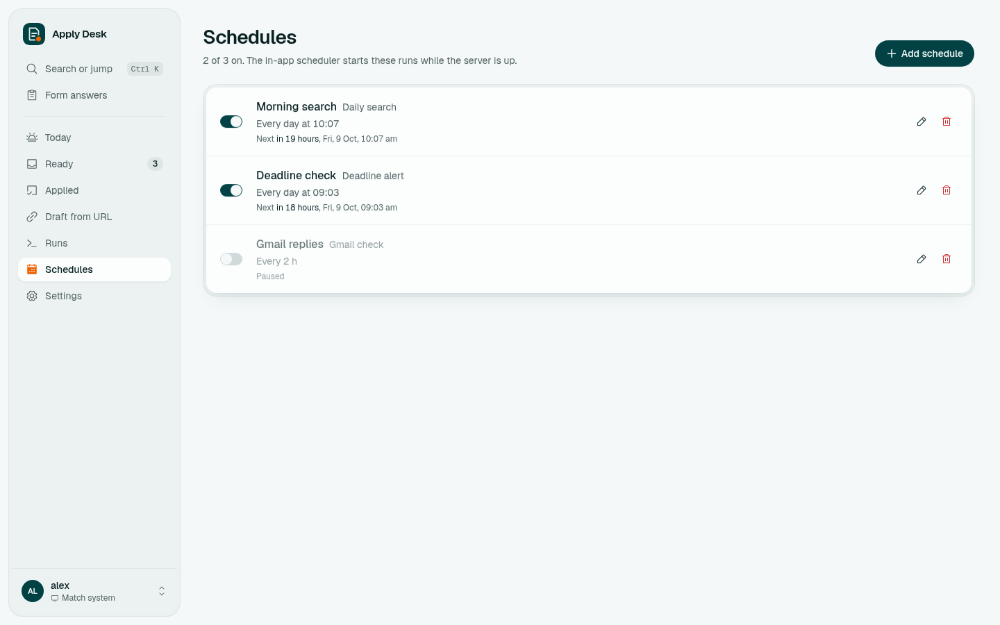
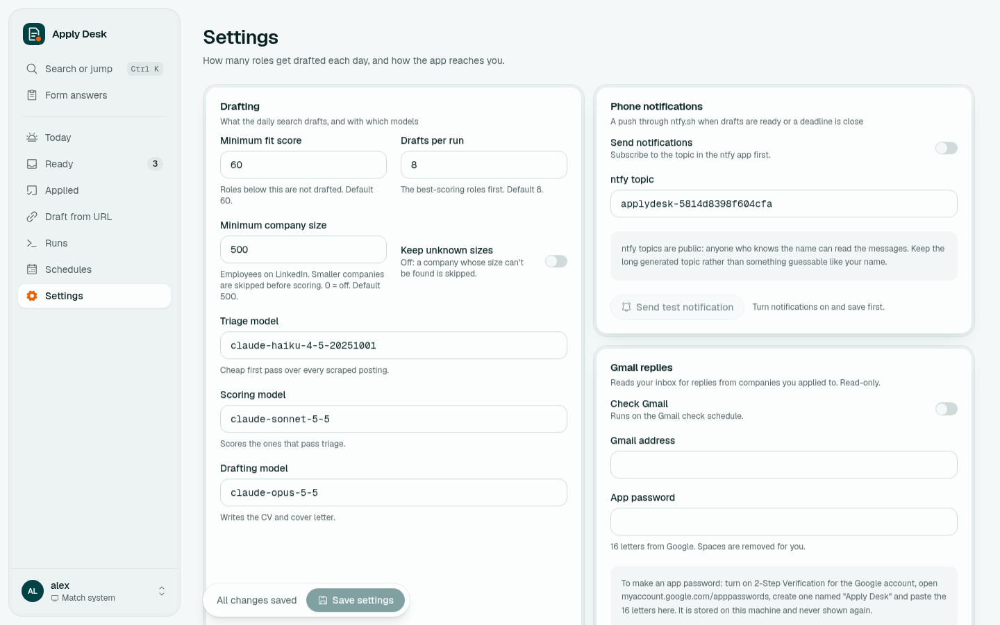
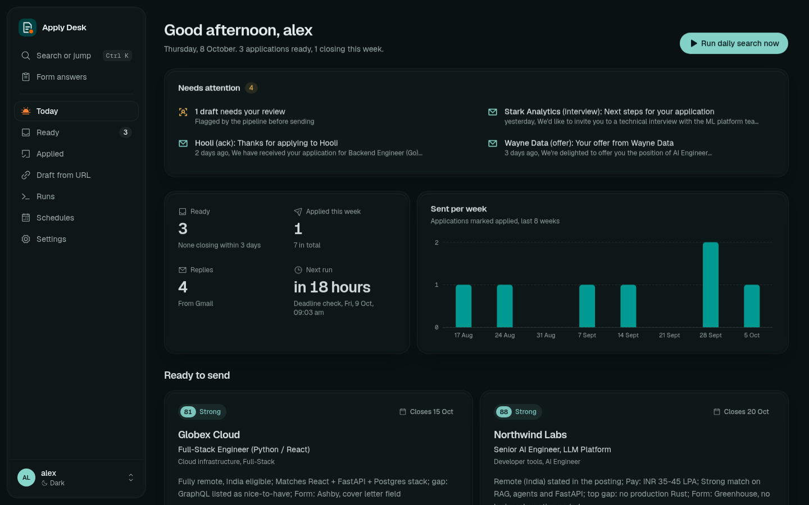
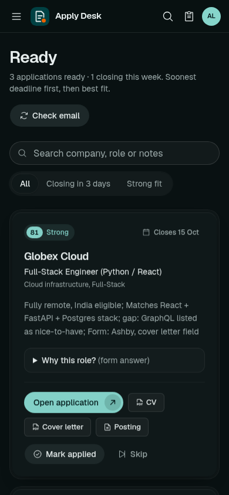
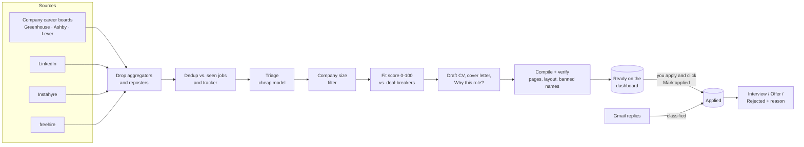

<p align="center">
  
</p>

<h1 align="center">Apply Desk</h1>

<p align="center">
  <b>Drafted overnight. Sent by you.</b><br>
  A self-hosted AI job-search assistant: it finds jobs every morning, drafts a tailored CV, cover letter and "Why this role?" answer for each, and reads your Gmail to keep every application current.
</p>

<p align="center">
  <a href="https://github.com/gysosin/apply-desk/actions/workflows/ci.yml"></a>
  <a href="LICENSE"></a>
  
  
  
</p>

<p align="center">
  <a href="#quick-start">Quick start</a> ·
  <a href="docs/claude-access.md">Subscription or API key</a> ·
  <a href="docs/apply-desk.md">User guide</a> ·
  <a href="https://github.com/gysosin/apply-desk/wiki">Wiki</a> ·
  <a href="SETUP.md">Setup</a>
</p>

<p align="center">
  <a href="docs/media/apply-desk-intro.mp4"></a><br>
  <sub>▶ <a href="docs/media/apply-desk-intro.mp4">Watch the 45-second intro</a> (every feature, with sound)</sub>
</p>

You stay in control: **Apply Desk never submits an application.** It prepares everything, you open the posting, apply on the employer's site, and click **Mark applied**.

> Independent open-source project built on [AI Job Search](https://github.com/MadsLorentzen/ai-job-search) by Mads Lorentzen (MIT). Not affiliated with or endorsed by Anthropic. Every screenshot and the video use fictional demo data.

---

## Contents

- [What it does](#what-it-does)
- [Screenshots](#screenshots)
- [How it works](#how-it-works)
- [Quick start](#quick-start)
- [Claude: subscription or API key](#claude-subscription-or-api-key)
- [Daily use](#daily-use)
- [Configuration](#configuration)
- [Your data and safety](#your-data-and-safety)
- [Project layout](#project-layout)
- [Documentation](#documentation)
- [Contributing](#contributing)
- [License](#license)

## What it does

| | Feature | Details |
|---|---|---|
| 🔎 | **Daily job search** | Reads company career boards directly (Greenhouse, Ashby, Lever), plus LinkedIn, Instahyre and freehire. Remote engineering roles posted in the last 30 days. |
| 🚫 | **No reposters** | Drops job aggregators and staffing reposters (Jobgether, Weekday, Turing, Crossover, Toptal and about 35 more) before anything is scored. |
| 🧮 | **Filter and score** | A cheap triage pass, a minimum company size, duplicate removal, then a fit score (0-100) against your profile and deal-breakers: location, remote, working hours, salary floor. |
| ✍️ | **Drafting** | For the best matches: a tailored 2-page CV and 1-page cover letter (LaTeX, compiled and layout-checked) and a pasteable 70-120 word "Why this role?" answer. Every claim comes from your own profile. |
| 📋 | **Ready dashboard** | Each draft with its fit score, deadline, notes on remote/pay/form, and buttons for the posting, CV, cover letter and Mark applied / Skip. |
| 📬 | **Gmail tracking** | Read-only IMAP. Confirmations mark a row Applied, assessments and invites move it to Interview, offers to Offer, rejections to Rejected, with the reason quoted from the email. Only new mail is read each time. |
| 🎤 | **Interview prep** | One click: the 8 most likely questions with answer outlines, the 3 gaps they will probe, and 5 questions to ask them. |
| 🔗 | **Draft from URL** | Paste any posting you found yourself; it is scored and drafted like the daily search. |
| ⏰ | **Schedules** | Daily search, deadline check and Gmail check on your times, run by the app itself. |
| 📱 | **Phone alerts** | Optional push notifications through [ntfy](https://ntfy.sh) when drafts are ready, deadlines are close or an offer arrives. |
| 🧾 | **Live run logs** | Every task shows each step as it runs, so you can see exactly what happened. |
| 🌗 | **Light, dark and mobile** | The dashboard works on your phone on the same Wi-Fi. |

## Screenshots

| Today | Ready to apply |
|---|---|
|  |  |
| **"Why this role?" answer** | **Applied, with outcomes from Gmail** |
|  |  |
| **Rejections show the reason** | **Live run log** |
|  |  |
| **Schedules** | **Settings** |
|  |  |
| **Dark mode** | **On a phone** |
|  |  |

## How it works



- **Backend:** Python, FastAPI and the [Claude Agent SDK](https://docs.claude.com/en/docs/agent-sdk/overview). Judgement steps (triage, scoring, drafting, reply classification, interview prep) go to Claude; everything else (scraping, dedup, state, verification, the tracker) is plain Python.
- **Frontend:** React, Vite and Tailwind, served by the same process.
- **Source of truth:** `job_search_tracker.csv`. The dashboard reads it live, so you can still edit it by hand.
- **Models:** triage on Haiku, scoring and Gmail on Sonnet, drafting on Opus by default. Each is a setting.

## Quick start

You need **Linux** (or WSL2 on Windows) for drafting, because CVs compile with TeX inside a `bubblewrap` sandbox. Search, scoring, Gmail and the dashboard run anywhere Python does.

### 1. Fork and clone

```bash
gh repo fork gysosin/apply-desk --clone
cd apply-desk
```

> [!IMPORTANT]
> **A fork of this repo is always public**, and `/setup` (step 3) writes your personal data (name, contact details, employment history, salary expectations) into **tracked** files. If this copy is for your own job search, use a **private repository** with this repo as `upstream` instead; the two-minute recipe is in [SETUP.md section 8](SETUP.md#8-pulling-upstream-updates-into-your-fork). Fork only to contribute.

### 2. Install the tools

Python 3.11+, [bun](https://bun.sh), TinyTeX in `~/.TinyTeX`, `bubblewrap` and `poppler-utils`. Step by step: [SETUP.md](SETUP.md) sections 1 and 3.

```bash
python3 -m venv .venv && .venv/bin/pip install -r app/requirements.txt
(cd app/web && bun install && bun run build)
```

### 3. Fill in your profile

```bash
claude        # then type /setup
```

The interview fills `CLAUDE.md` and `.claude/skills/job-application-assistant/01-candidate-profile.md`, which every draft is grounded in. You can also fill them by hand.

### 4. Connect Claude

Use your Claude subscription (`claude`, then `/login`) or an API key (`export ANTHROPIC_API_KEY=sk-ant-...`). Details below and in [docs/claude-access.md](docs/claude-access.md).

### 5. Run it

```bash
.venv/bin/python -m app set-password --username me
.venv/bin/python -m app selftest      # tools, login and Claude access
.venv/bin/python -m app serve         # open http://127.0.0.1:8770
```

Want it always on, with HTTPS at `https://applydesk.localhost`? Use Docker: [docs/apply-desk.md](docs/apply-desk.md#run-it-always-on-with-docker).

## Claude: subscription or API key

| Option | You need | You pay | Set up |
|---|---|---|---|
| **Subscription login** | Claude Pro or Max | Nothing extra; counts against your plan | `claude` → `/login` |
| **Subscription token** | Claude Pro or Max | Same | `claude setup-token` → `CLAUDE_CODE_OAUTH_TOKEN` |
| **API key** | An Anthropic Console account | Per token | `ANTHROPIC_API_KEY=sk-ant-...` |

With Docker, put the token or key in `app/.env` (copy `app/.env.example`; it is git-ignored). Amazon Bedrock and Google Vertex AI work too. Cost tips and model choices: [docs/claude-access.md](docs/claude-access.md).

## Daily use

1. The morning search runs on schedule (or click **Run daily search now**).
2. Open **Ready**: read the fit note, open the CV and cover letter, copy the "Why this role?" answer.
3. Click **Open application**, apply on the employer's site, then **Mark applied**.
4. The Gmail check moves applications forward as replies arrive; **Applied** shows each outcome with its reason.
5. Got an interview? Click **Prepare interview**.

## Configuration

| Where | What |
|---|---|
| **Settings page** | Minimum fit score, drafts per run, minimum company size, the model for each step, phone notifications, Gmail address and app password |
| **Schedules page** | Daily search, deadline check, Gmail check |
| `CLAUDE.md` + the candidate profile | Who you are, your deal-breakers, target roles |
| `app/boards.py` → `BOARDS` | Company career boards to read |
| `app/pipeline.py` → `LINKEDIN_QUERIES`, `AGGREGATORS` | Search queries and the blocklist |
| `app/store.py` → `ANSWERS` | Standard form answers shown on the dashboard |
| `~/.config/applydesk/config.json` | Secrets and settings (mode 600, outside the repo) |

The defaults target **remote roles open to India**. To change that, see [Job sources and filters](docs/apply-desk.md#job-sources-and-filters).

## Your data and safety

- Your tracker, generated documents, Gmail state and run logs stay on your disk and are git-ignored.
- Secrets (the dashboard login hash and Gmail app password) live in `~/.config/applydesk/config.json`, outside the repo, where the AI agents cannot read them.
- Agents have no browser or form tools and cannot submit anything. Every tool call passes `app/guards.py`: no git, `curl` GET only, writes only to `cv/`, `cover_letters/`, `documents/applications/` and `company_research/`.
- Agent-written TeX compiles only inside a `bubblewrap` sandbox: no network, home directory hidden, only the document folder writable.
- Job postings and emails are treated as untrusted data in every prompt, and Gmail access is read-only.
- Names you list in `app/data/banned_names.txt` can never appear in a draft; a draft that contains one is held for review.

## Project layout

```
app/                  Apply Desk (FastAPI backend, scheduler, pipeline)
  web/                React dashboard
  prompts/            Prompts for triage, scoring, drafting, replies, interview prep
  tests/              Backend tests
docs/                 User guide, Claude access, screenshots, intro video
cv/, cover_letters/   LaTeX templates and your generated documents
.claude/              Claude Code skills and slash commands (/setup, /apply, /interview ...)
tools/                PDF verification, ranking state and other helpers
FRAMEWORK.md          The original Claude Code workflow this builds on
```

## Documentation

- **[Wiki](https://github.com/gysosin/apply-desk/wiki):** installation, every feature, configuration, architecture, troubleshooting and FAQ.
- **[docs/apply-desk.md](docs/apply-desk.md):** the user guide.
- **[docs/claude-access.md](docs/claude-access.md):** subscription, token or API key; costs and models.
- **[SETUP.md](SETUP.md):** installing Python, bun and TeX, and the `/setup` interview.
- **[FRAMEWORK.md](FRAMEWORK.md):** the Claude Code slash-command workflow.
- **[app/API.md](app/API.md):** the HTTP API.

## Contributing

Issues and pull requests are welcome. Start with [CONTRIBUTING.md](CONTRIBUTING.md); security reports go through [SECURITY.md](SECURITY.md).

```bash
.venv/bin/python -m unittest discover -s app/tests -t .   # Apply Desk tests
python -m unittest discover -s tests -t .                 # framework tests
cd app/web && bun run build                               # dashboard
```

## License

MIT, see [LICENSE](LICENSE). The original AI Job Search framework is © Mads Lorentzen.
