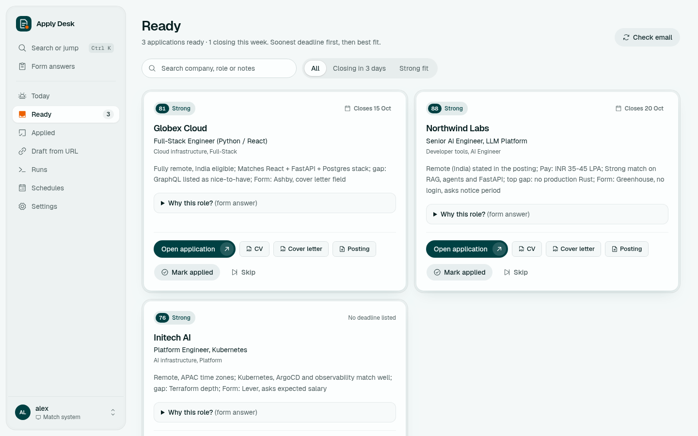
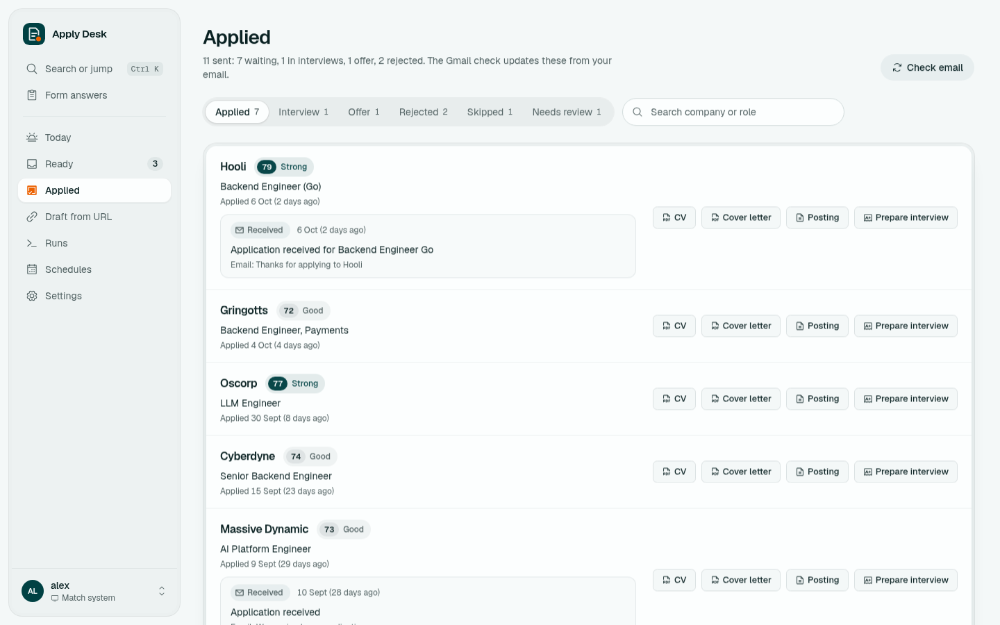

# Using Apply Desk



More: the [wiki](https://github.com/gysosin/apply-desk/wiki) covers every feature in depth.

## Daily use

1. **Today:** what's new, how many applications are waiting, and applications sent per week.
2. **Ready:** each drafted application with its CV, cover letter, fit note, form notes and a "Why this role?" answer you can copy. Open the posting, apply yourself, then click **Mark applied**, or **Skip** it.
3. **Applied:** tabs for Applied, Interview, Offer, Rejected, Skipped and Needs review. Each row shows the latest outcome and the reason taken from the email. **Check email** syncs Gmail now. **Prepare interview** writes talking points for that application.
4. **Draft from URL:** paste a posting you found yourself. It is scored and drafted like the daily search.
5. **Runs:** every task with a live log. Use **Run now** to start any task by hand.
6. **Schedules:** defaults are Morning search (daily, 10:07), Deadline check (daily, 09:03) and Gmail replies (every 2 hours, off until Gmail is set up).
7. **Settings:** fit score, drafts per run, minimum company size, models, notifications and Gmail.

## Gmail replies



1. Turn on 2-step verification in your Google account and create an **app password** (Google Account → Security → App passwords).
2. Settings → Gmail: enter your address and the app password, turn on **Check Gmail**, then turn on the Gmail schedule.

Access is read-only IMAP. The first check reads 180 days; after that, only new mail. A confirmation email marks a row Applied, and replies for untracked roles get their own row. Status only moves forward, and a rejection never overwrites an offer.

## Phone notifications

Settings → turn on **Send notifications**, install the [ntfy](https://ntfy.sh) app and subscribe to the topic shown there.

## Job sources and filters

- **Company career boards:** the `BOARDS` list in `app/boards.py` (Greenhouse, Ashby and Lever board tokens). Add a company with its token, which is the name in its job-board URL.
- **LinkedIn, freehire:** the queries in `app/pipeline.py` (`LINKEDIN_QUERIES`, `FREEHIRE_QUERIES`).
- **Instahyre:** the queries in `app/instahyre.py`.
- **Blocked aggregators and staffing firms:** `AGGREGATORS` in `app/pipeline.py`.
- **Location:** the defaults target **remote roles open to India**. To change that, edit `--location` in `scrape()` (`app/pipeline.py`) and the `INDIA` pattern in `app/boards.py`. Your deal-breakers in `CLAUDE.md` drive the scoring.
- **Application-form answers** on the dashboard: `ANSWERS` in `app/store.py`.
- **CV check:** set `"cv_email": "you@example.com"` in `~/.config/applydesk/config.json` to require your email in each CV's text layer.

## Run it always on with Docker

```bash
sh app/deploy/make-cert.sh                      # local HTTPS certificate for applydesk.localhost
sudo trust anchor ~/.config/applydesk-tls/applydesk-ca.crt    # trust it (Fedora/Arch; Debian: update-ca-certificates)
cp app/.env.example app/.env                    # only if you use a token or API key
docker compose -f app/docker-compose.yml up -d --build
```

Open https://applydesk.localhost. TinyTeX (`~/.TinyTeX`), bun (`~/.bun`) and your Claude login (`~/.claude`) are mounted from the host. Stop it with `docker compose -f app/docker-compose.yml down`.

## Commands

```bash
.venv/bin/python -m app serve                         # dashboard on http://127.0.0.1:8770
.venv/bin/python -m app run daily_run --max-drafts 2  # one task in the foreground
.venv/bin/python -m app run draft_url --url https://...
.venv/bin/python -m app set-password --username me
.venv/bin/python -m app selftest                      # tools, login, Claude access
docker compose -f app/docker-compose.yml logs -f applydesk
```

## Troubleshooting

- **selftest says Claude FAIL:** see [claude-access.md](claude-access.md).
- **lualatex/xelatex missing:** install TinyTeX (SETUP.md, section 1).
- **Logged out after a restart:** sessions are kept in memory, so log in again.
- **Drafts in "Needs review":** a check failed (page count, layout or a banned name). The run log says which.
